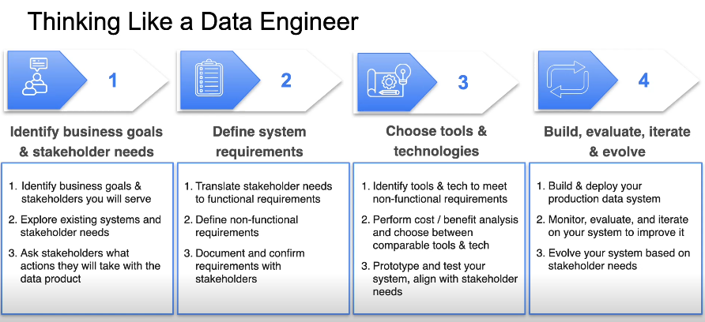

## Introduction to Data Engineering

## Requirements / Links

- https://www.w3schools.com/python/pandas/default.asp
- https://www.kaggle.com/learn/pandas
- https://sqlbolt.com/
- https://www.coursera.org/learn/aws-cloud-practitioner-essentials
- https://www.coursera.org/learn/aws-cloud-technical-essentials
- https://go.redpanda.com/fundamentals-of-data-engineering

Course Page:

- https://community.deeplearning.ai/t/about-the-data-engineering-category/682143
- https://community.deeplearning.ai/t/data-engineering-course-1-lecture-notes/697773?_gl=1*sdol5a*_gcl_au*MTU0MzExMzIzOS4xNzkwOTU5MjA5*_ga*OTM4MTg5MjM0LjE3ODk3NTgzMDg.*_ga_FR2MZ1VLMS*czE3OTA5NjcyNDckbzYkZzEkdDE3OTA5Njg3ODQkajYwJGwwJGgw

## W1. Intro to Data Engineering

### Intro

Stakeholder Needs -> System Requirements (Functional | Nonfunctional) -> Technology/Tool Choices(Ingestion | Storage | Transformation | Serving)

**DE Lifecycle**:
1. Generation
2. Storage
   1. Ingestion
   2. Transformation
   3. Serving
3. Analytics | ML | Reverse ETL

**Undercurrents:**
1. Security
2. Data Management
3. DataOps
4. Data Architecture
5. Orchestration
6. Software Engineering

**Data Pipeline:** Combination of architecture, systems, and processes that move data. 

  

Relational Databases - SQL
Data Warehouse
Data Modeling
Big Data - Velocity, Variety, Volume
MapReduce
Hadoop
Amazon EC2
Amazon S3
Amazon DynamoDB
AWS
GCP
Azure
Batch Computing to Event Streaming

  

Know your downstream and upstream stakeholders. 
Query frequency, latency, data, timezones, ...
Data format, volume, ... 
Security, Regulatory Compliance, ... 

  

**Find Business Value.** (Revenue, Cost Savings, Efficiency, New product)

**Requirements**
1. Business
2. Stakeholder
3. System
   1. Functional - What
   2. Nonfunctional - How

**Requirements Gathering**
1. Business and Stakeholder requirements
2. Features and Attributes
3. Memory and Storage Capacity
4. Cost and Security Constraints

Snowflake, DBT, ...

What is it that the consumers are expecting to see and how does it help them?
What actions do they plan on taking?

  

Learn existing data systems and processes. 
Learn pain points or problems. 
Learn what actions stakeholders plan to take. 
Identify stakeholders. 

  

real-time data, one manual data dump each day. 
problems with schema changes and anomalies in data. 
better ingestion solution?
disruptions or changes? how can we anticipate?
data cleaning and processing. 
what is real-time?

  

  

**CDO** Cheif Data Officer
**KPI** Key Performance Indicator
**P&L** Profit and Loss Statement
**ERP** Enterprise Resource Planning
 
**Data Literacy** comfort and confidence in using data. 

**Understand how the business operates.**

---

### Data Engineering on the Cloud

On-Premises | Cloud | Hybrid

Compute | Storage | Networking | Databases | Security | Data Streaming | Ingestion | Transformation 

Scalable and Elastic. 

**AWS Regions** Collections of data centers. 34. Independent from one another. 
1. Latency
2. Cost
3. Compliance
4. Service availability

**Availability Zones** Small group of data centers. Each region has atleast 3 AZs. Seperated by about 60 miles | 100 kms. Interconnected. 

**EC2** Elastic Compute Cloud. VMs. 
**AWS Lambda**
**ECS** Elastic Container Service
**EKS** Elastic Kubernetes Service

**VPC** Virtual Private Cloud. Can be partitioned into **Subnetworks** or **Subnets** Spans AZs, but can not span Regions. 

**S3 Simple Storage Service** 
**EBS Elastic Block Service** typically used for db storage, vm file systems, low-latency environments
**EFS Elastic File System** 
**RDS Relational Database Service**
**Redshift** Data warehouse service. 

AWS uses Shared Responsibility Model. AWS takes care of Cloud. You take care of security in the cloud. 

**Server** - Hardware, OS, Application
**Virtual Machine** - software representation or emulation of actual server. 

**Hypervisor** - Shares actual resources across virtual machines. 

**EC2 Spot Instances** Unused resources. 

  

**IP** Internet Protocol. 
- **Network Address** 
- **Host Address**

**Classful address** total length of address was fixed, as were the number of bits allocated to network and host portions. 

**IPv4** 32 bit integer. 4 8-bit numbers. Each can take 0 to 255
- **Class A** 8 network prefix bits. 
- **Class B** 16 network prefix bits. 
- **Class C** 24 network prefix bits. 

**CIDR** Classless Inter-Domain Routing. Aka Classless addresses. Range of IP addresses. (1.1.1.x/24) => first 24 bits are fixed, and last 8 bits can be any. Uses **VLSM** Variable Length Subnet Masking. The suffix value is the network address prefix bits. 

**VPC** by default doesn't communicate with different VPCs or outside world. 

**Subnets** private and public. Created inside AZ. Subset of VPC CIDR Range. 

**Supernet** group of subnets with similar network prefixes. 

## W2: Data Engineering Lifecycle and Undercurrents. 

### DE Lifecycle

**Data Generation**
**Source Systems:** Databases: Relational, NonRelational, Files, APIs, IoT
**Data Ingestion:** Batch vs Streaming. Near real-time. CDC. Push/Pull Approach. 

SSD, RAM, Magnetic Discs

Data Warehouse | Data Lake | Data Lakehouse

**Data Transformation:**
1. Querying - Performance, Row explosions
   1. Cleaning
   2. Joining
   3. Aggregating
   4. Filtering
2. Data Modeling
   1. Normalized -> Denormalized. 
3. Data Transformation

  

**Analytics** process of identifying key insights and patterns within data. 

**Business Intelligence** Historical and Current data. Insights. 
**Operational Analytics** Monitoring real-time data for immediate action. 
**Embedded Analytics** External or customer facing analytics. 

  

### Undercurrents of DE Lifecycle

Undercurrents are practices that apply to all stages of data engineering lifecycle. 

**Security** 
1. **Principle of Least Privilege**
2. **Zero Trust Principle**
3. **Data Access &  Sensitivity**
4. **IAM Identity and Access Management**
5. **Encryption Methods**
6. **Networking Protocols**

**Data Management**
1. **DAMA** Data Management Association International. 
2. **DMBOK** Data Management Book of Knowledge
   1.  Data Management - practices - deliver, control, protect, and enhance value of data. 
3.  11 Data Knowledge Areas
    1.  Data Governance - quality, integrity, security, usability of data
    2.  Data Modeling and Design
    3.  ... 

**Data Architecture** - design of systems that support evolving data needs. 
1. Flexible and Reversible Decisions
2. Choose Common Components wisely
3. Plan for failure. 
4. Architect for scalability. 
5. Architecture is leadership
6. Always be architecting. 
7. Build loosely coupled systems
8. Make reversible decisions. 
9. Prioritze security. 
10. Embrace FinOps

**DataOps**
1. DevOps - Lean and Agile - Removal of bottlenecks, Reduction of waste, Quick identification of problems and Rapid Iteration.
2. DataOps - cultural habits and practices
   1. Communication and Collaboration
   2. Continuous Improvement - Learn, Improve, Feedback
   3. Rapid Iteration
   4. Pillars
      1. Automation
         1. CICD - Continuous Integration and Continuous Delivery. 
         2. Automated Change Management
            1. Scheduling - you schedule all tasks.
            2. Orchestration Framework - you schedule the main task, and it takes care of starting the dependent tasks. 
      2. Observability and Monitoring
      3. Incident Response
         1. identify root cause
         2. resolve incident
         3. coordinate efforts

**Orchestration**
1. Orchestration Framework - automate pipelines with compelx dependencies. DAG: Directed Acyclic Graph
   1. Apache Airflow
   2. Dagster
   3. Prefect
   4. Mage

**Software Engineering** Design, Development, Deployement, Maintenance

  

### Practical Examples on AWS

RDS Relational
DynamoDB - NoSQL
KDS Kinesis - Streaming
SQS Simple Queue - messages
MSK Managed Streaming for Apache Kafka
DMS Data Migration Service
Glue - ETL Service
Data Firehosue - Streaming

Redshift
S3

Glue
Spark
DBT

Athena - Query service. Run SQL Queries against S3.
Redshift
Dashboard Tools
- QuickSight
- Apache Superset
- Metabase  

  

Security - Shared Responsibility Model; IAM - Roles, Permissions; Firewalls

Data Management - Glue Crawler, Glue Data Catalog, Lake Formation

DataOps - CloudWatch, CloudWatch Logs, SNS - Simple Notification Service, Monte Carlo, Bigeye

Orchestration - Airflow, Dagster, Prefect, Mage

Architecture - Well-Architected - Operational Efficiency, Security, Relaiability, Performance Efficiency, Cost Optimization, Sustainability. 

Software Engineering: CodeDeploy, Git, GitHub

Terraform - Infrastructure as a code tool. IaC. Automate create, configure, teardown of AWS resources. 

  

